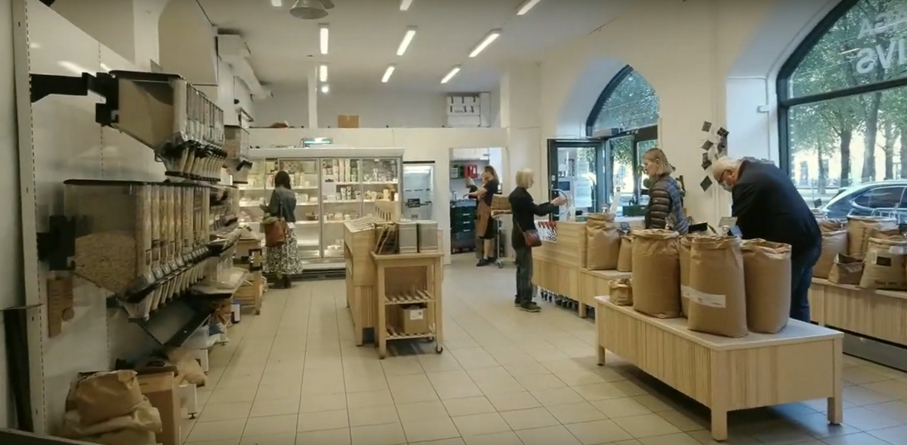
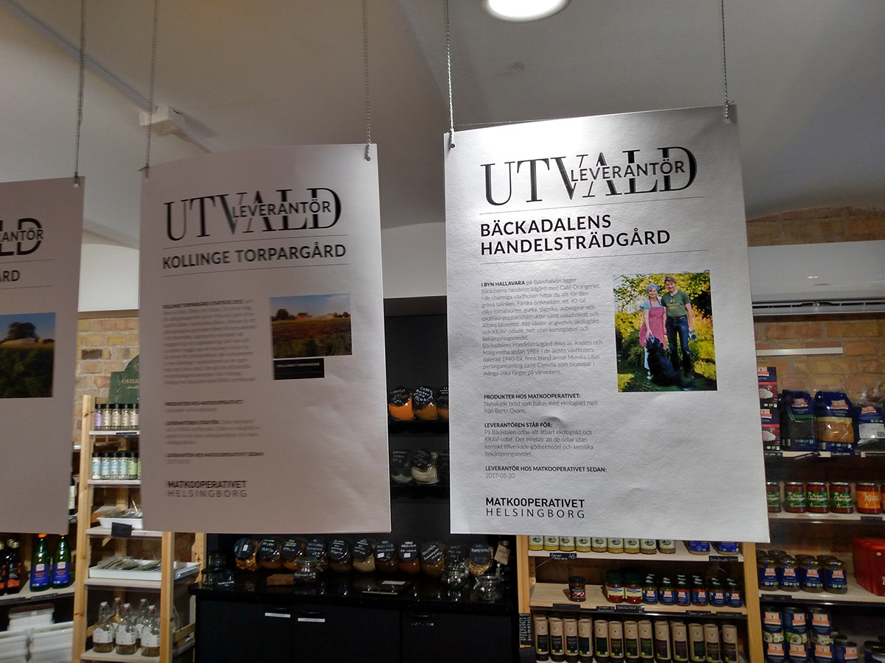
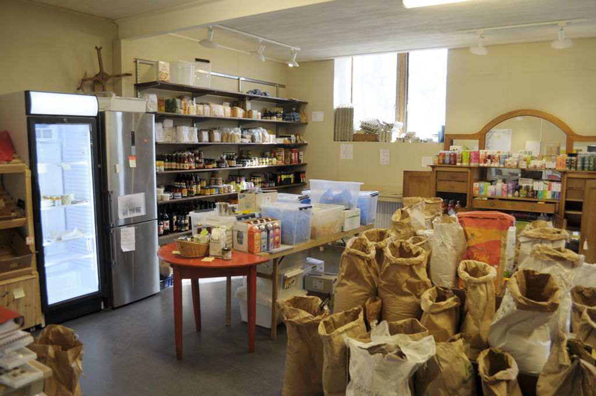
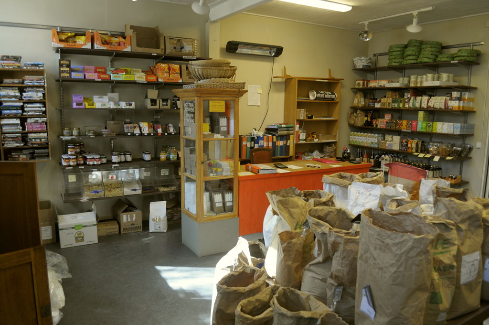

## Förening & Lokal

I många fall så skapas matkooperativ i samband med att medlemmarna hittar en lokal som man vill nyttja för att tillsammans kunna förvara och distribuera mat igenom. Dessa lokaler kan vara så enkla som någons garage till butiker som är öppna även för icke-medlemmar.

Lokalerna sätter ofta en prägel och form på kooperativen då saker som plats, hyreskostnad och miljö ger bättre eller sämre förutsättningar för olika variationer. Lokaler med hög hyra som då också gärna ligger centralt i en större bebyggelse har ofta både större ekonomisk press och bättre ekonomiskt underlag att fungera mer som en vanlig butik än en lokal som ligger avsides ute på landsbygden.

## I praktiken

Föreningslokaler och butiker kan se ut på många olika sätt beroende på utrymme, öppet för offentlighet eller inte samt personal. Lokaler är en möjlighet att realisera många av de värden utöver just att handla mat som ett matkooperativ kan bygga på.

_FRAM ekolivs Göteborg_

### Mat och mer

I flera organisationer finns många aktiviteter förutom handel av mat som en viktig del. Cafe, samtal och events är ofta organiserade i lokalerna. Att vara en mötesplats är ofta en av de stora drivkrafterna kring varför människor engagerar sig i matkooperativen.

Producenter kan också komma till kooperativen för att presentera sig och sina produkter, dessa eller liknande tillfällen fungerar också som utbildning kring maten vi äter.

Butiken kan också vara en plats där lokala producenter kan presentera sig för medlemmarna och börja bygga relationer. Ofta finns det en grupp inom kooperativet som jobbar med att sätta upp skyltar, göra plats för nya varor och hålla lokalen fin. Även skyltar för alla varor med priser och innehåll hanteras ofta av en butiksgrupp.

_Utvalda leverantörer visas upp på Matkooperativet Helsingborg_

### Tillgänglighet

En stor fördel med att vara medlem i ett matkooperativ kan vara tillgången till lokalen dygnet runt. Det är inte alltid fallet, speciellt ifall butiken även är öppen för icke-medlemmar och ofta då har striktare öppettider. Men i många inköpsföreningar så kan medlemmarna komma och gå när de vill och handlar själva genom att notera vad det är man har tagit på något sätt i butiken.

Medlemmar kan ofta komma in i lokalen genom att använda en tag eller ett kodlås. Matkooperativen drivs med en stor mängd tillit då det sällan finns kameror eller andra säkerhetssystem för att förhindra stölder etc.

## Exempel - Lokaler

### Kooperativet Nässlan

> Vi har nyligen flyttat till en liten lokal utanför kommuncentrum. Där finns våra varor att hämta. Man skriver upp sina varor i en pärm och inköpen dras mot förskott som man har betalat in till föreningens konto. Lokalen är tillgänglig dygnet runt.

### Ekoskafferiet i Stjärnsund

> Medlemmar kan komma in dygnet runt med kodlås på kursgården/vandrarhemmet. För icke-medlemmar är det öppet mellan kl 8-20

### Bottnafjordens inköpsförening

Butiken som föreningen nu har är den tredje i föreningens historia. Det är också den enda som medlemmarna har tillgång till under hela året, och med nyckelbricka även dygnet runt. Butiken är öppen endast för föreningsmedlemmar. Under några timmar på torsdagar finns det en kassör närvarande som ger möjligheten att betala med kontanter samt att ge handledning till nya medlemmar.

Butiken har också en avdelning för återbruk, kläder och böcker. Samt en gåvohylla med saker som folk inte längre behöver.

Flera arbetsgrupper i föreningen har butiken som ansvarsområde. Städning, varuvård (kontrollera bäst före datum), skyltning/information, uppackning och prismärkning etc.

_Butiken hos Bottnafjordens inköpsförening_

_Butiken hos Bottnafjordens inköpsförening_

## Länkar

[Presentation av butik - videoklipp om Helsingborg](https://www.youtube.com/watch?v=2iByBOMbaLM)  
[Presentation av butik - videoklipp om Fram](https://www.youtube.com/watch?v=zPqz3EmUseo)  
[Presentation av butik - videoklipp om Bottnafjordens Inköpsförening](https://www.youtube.com/watch?v=DruNhgSbPdQ)
