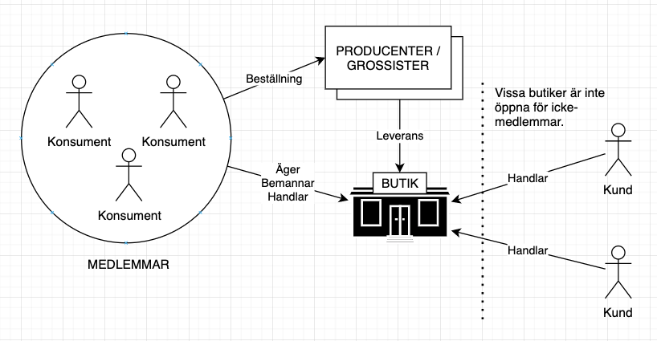
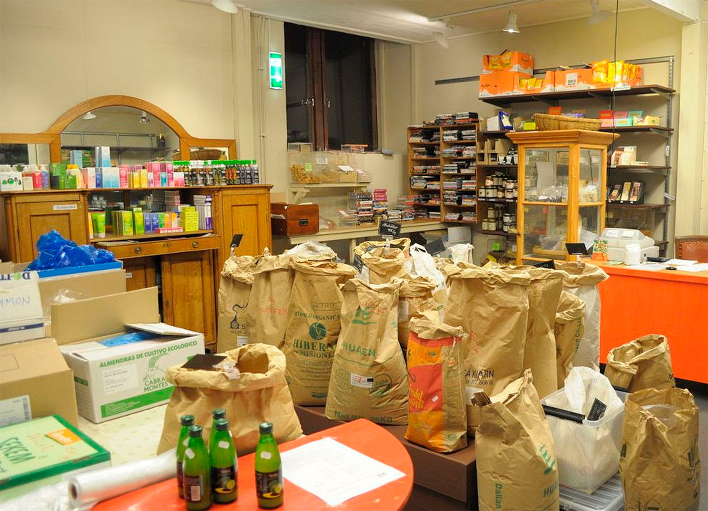
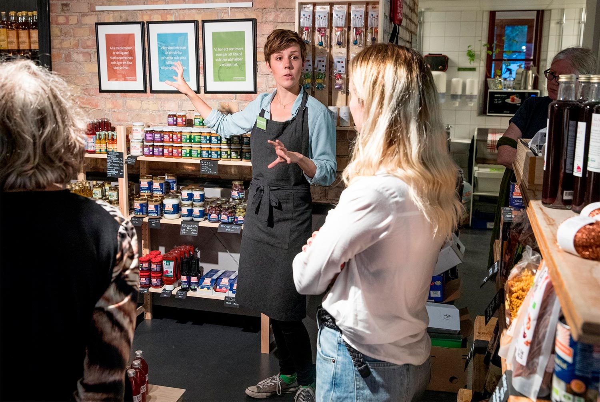

I konsumentkooperativet går konsumenter samman för att driva något som mer liknar en ordinarie matbutik. COOP har sina rötter i de konsumentföreningar som startades i slutet av 1800-talet och senare bildade Kooperativa Förbundet/KF.

Många konsumentkooperativ bemannas av medlemmarna endast. Vissa håller anställd personal som tillsammans med medlemmar sköter driften av butiken.

Vissa konsumentkooperativ är öppna endast för medlemmar medan andra tillåter icke medlemmar som kunder. Ofta byggs det runt kooperativet upp ytterligare verksamhet, till exempel mötesplats, bibliotek eller kafé.

## Exempel

### Bottnafjordens Inköpsförening

Bottnafjordens Inköpsförening är ett av Sveriges äldsta konsumentkooperativ och ett exempel på ett matkooperativ som fungerar som en central punkt i lokalsamhället Gerlesborg/Bottna. Lyssna när några av medlemmarna i föreningen bjuder på en rundtur i butiken och berätta om driften av föreningen:

<iframe
  width="560"
  height="315"
  src="https://www.youtube.com/embed/DruNhgSbPdQ"
  frameborder="0"
  allow="accelerometer; autoplay; clipboard-write; encrypted-media; gyroscope; picture-in-picture"
  allowfullscreen
></iframe>
<iframe
  width="560"
  height="315"
  src="https://www.youtube.com/embed/wCNrQ7GhPck"
  frameborder="0"
  allow="accelerometer; autoplay; clipboard-write; encrypted-media; gyroscope; picture-in-picture"
  allowfullscreen
></iframe>

### Matkooperativet Helsingborg

Matkooperativet Helsingborg startades 2017 och drivs tillsammans av medlemmarna. Man behöver dock inte vara medlem för att få handla i butiken.

> Vi är en hållbar, medlemsägd mataffär med fokus på lokalproducerade varor. Genom att jobba ideellt kan du handla billigare hos oss och du hjälper dessutom till att rädda miljön. Om du hjälper till 6 timmar i månaden får du hela 10 procent rabatt på allt du handlar i butiken.

Det första videoklippet är en rundtur i butiken, i det andra berättar William mer om hur butiken blev till, ekonomi, sortiment etc.

<iframe
  width="560"
  height="315"
  src="https://www.youtube.com/embed/2iByBOMbaLM"
  frameborder="0"
  allow="accelerometer; autoplay; clipboard-write; encrypted-media; gyroscope; picture-in-picture"
  allowfullscreen
></iframe>
<iframe
  width="560"
  height="315"
  src="https://www.youtube.com/embed/pfJ_zA1A6w8"
  frameborder="0"
  allow="accelerometer; autoplay; clipboard-write; encrypted-media; gyroscope; picture-in-picture"
  allowfullscreen
></iframe>

## Länkar

[Bottnafjordens Inköpsförening](http://bottnafjorden.se/inkopsf/wp/)  
[Matkooperativet Helsingborg](https://matkooperativet.se/)  
[Lokatten Matkooperativ](https://www.lokatten.org/)  
[Bikupan](https://bikupan.org/)  
[Ekoskafferiet Stjärnsund](https://www.facebook.com/EkoskafferietStjarnsund/)  
[Ekolivs Malmö](https://www.ekolivs.se/)  
[Tuvan Ekolivs](https://tuvanbutiken.se/)  
[Skattunge Handel](https://www.facebook.com/skattungehandel/)  
[Morjärvsbygdens Handel & Utveckling Ekonomisk Förening](https://www.facebook.com/groups/1117202295111046/)  
[Arholma Handel](http://arholma.nu/for-oss-boende/foreningar/arholma-ekonomiska-forening/)
