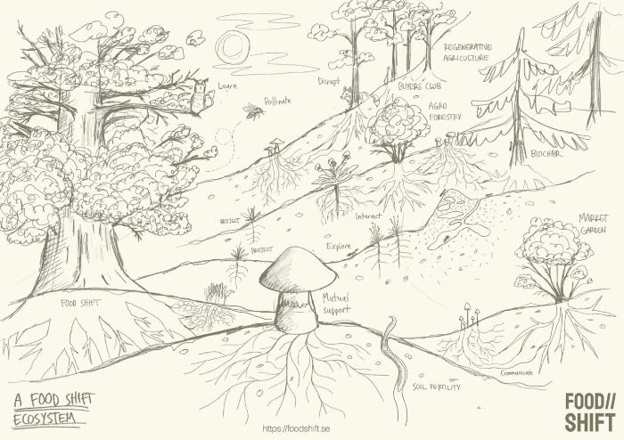

Förenade Inköp är ett projekt som vuxit ur Food Shift, ett öppet nätverk och en plattform för aktörer som jobbar bortom hållbarhet. Organisationer, företag, forskare och privatpersoner som inte stannar vid det cirkulära eller det hållbara utan fokuserar på att också återskapa, återuppbygga, regenerera det som förstörts, det som gått förlorat. I det utrymmet vill vi verka på många plan:

➤ Nätverka, både fysiskt och på våra digitala plattformar.  
➤ Seminarier, workshops, un-conferences.  
➤ Utforska och lära tillsammans, dela kunskap, best practices.  
➤ Extern kommunikation för att lyfta frågor och påverka samhällsdebatten - blogg, video, artikel.  
➤ Stöda idéarbete - jobba aktivt och systematiskt med att nära idéer. En accelerator/inkubator för regenerativa projekt.  
➤ Utgöra en samlande kraft som på kan jobba med kartläggning, överblick och strategier och på sikt även kanske hjälpa organisationer som vill utvecklas i regenerativ riktning.

Food Shift är ett participartoriskt projekt. Riktningen vi tar framöver styrs av personerna som engagerar sig, vilka projekt vi lyckas säkra finansiering för osv.

**Hur kan du bidra och engagera dig?**

➤ Följ vår facebook-sida för nyhetsuppdateringar

[https://www.facebook.com/foodshiftcollective/](https://www.facebook.com/foodshiftcollective/)

➤ Följ Food Shift på Twitter:

[https://twitter.com/food_shift](https://twitter.com/food_shift)

➤ Skapa ett konto för samarbeten och lärande på:

[https://foodshift.se](https://foodshift.se/)

➤ Kom och prata med oss på Slack:

[https://foodshift.se/slack](https://foodshift.se/slack)

➤ Se videos, intervjuer och webinarier på vår Youtube-kanal

[https://www.youtube.com/channel/UCsyQNBs8_Vh4u-OJ5Tce3Ow](https://www.youtube.com/channel/UCsyQNBs8_Vh4u-OJ5Tce3Ow)

➤ Tipsa dina vänner om att vi finns

**Välkommen till skiftet!**
