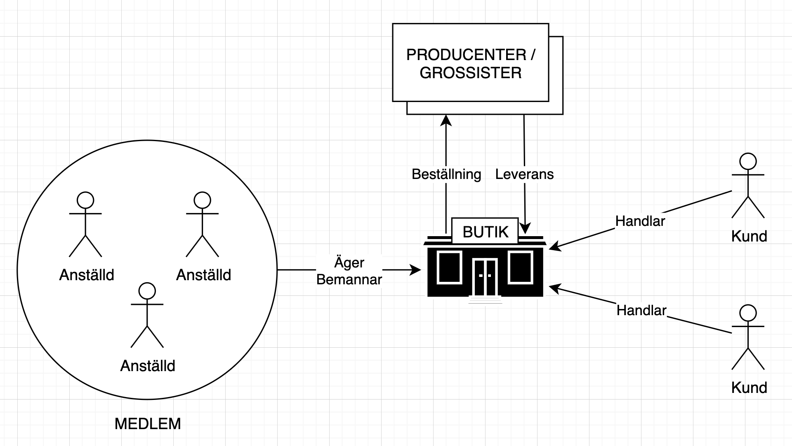
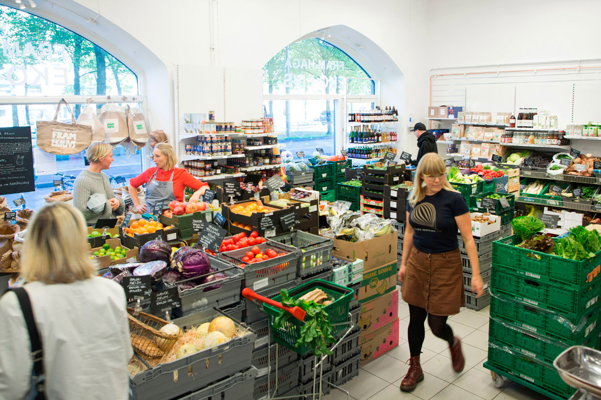

Personalkooperativet liknar konsumentkooperativet med ett par avgörande skillnader:

1. Medlemmarna utgörs av de anställda istället för av konsumenterna, vilket också innebär att…
2. … externa kunder / icke-medlemmar alltid är välkomna att handla i butiken.
3. För att vara medlem måste du vara anställd, alla anställda är dock inte alltid medlemmar.

Personalkooperativ består ofta av ett mindre antal medlemmar som tillsammans driver en verksamhet. Det är också vanligt att medlemskapet kommer med en rätt till utdelning av ev vinst från verksamheten.

Internationellt sett är personalkooperativ en vanlig samarbetsform på allt från bilverkstäder till stora fabriker. I Sverige är formen inte lika vanlig men framhålls allt oftare som en lämplig modell vid exempelvis generationsväxlingar. Ett personalkooperativ bildas då för att ta över verksamheten i samband med att ägaren vill sälja eller gå i pension.

## Exempel

### Fram

Ekobutiken [FRAM](https://framekolivs.se/) i Göteborg etablerades 1984, då som ett medlemskooperativ. Butiken har över tiden utvecklats till att bli ett personalkooperativ som drivs utan vinstintresse. Föreningen har ca 10 medlemmar/anställda med butikslokal centralt i Göteborg.

> Att handla på Fram ger dig som konsument möjlighet att påverka miljön. Köper du ekologiskt och rättvisemärkt vet du att odlaren får anständig lön och slipper handskas med gifter. Hur vi väljer vår mat har betydelse för miljön och människors liv både i Sverige och i andra länder. Fram drivs som ett personalkooperativ där all vinst stannar i verksamheten. Vi jobbar hårt för att kunna hålla priserna nere på ekologisk mat, särskilt de mest grundläggande råvarorna, så att fler ska kunna ha råd med ekologiskt.

<iframe
  width="560"
  height="315"
  src="https://www.youtube.com/embed/zPqz3EmUseo"
  frameborder="0"
  allow="accelerometer; autoplay; clipboard-write; encrypted-media; gyroscope; picture-in-picture"
  allowfullscreen
></iframe>

## Länkar

[Fram Ekolivs](https://framekolivs.se/)
