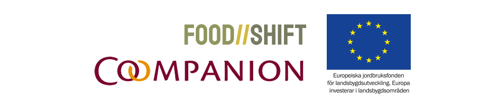

# En handbok för matkooperativ

### Mat förenar

Hur skapas delaktighet i matens väg mellan odlare, producent och kök? Hur kan vi främja lokal livsmedelsproduktion och förädling? Kort sagt, hur kan vi låta maten vara något som skapar gemenskap, förankring och engagemang i vårt lokalsamhäle och vår omvärld?

Det finns flera svar på dessa frågor men ett nygammalt alternativ är att organisera oss i kooperativ form, bilda inköpsföreningar, mat- och producentkooperativ och tillsammans lägga grunden för ett nytt livsmedelssystem. Tillsammans med lokala marknadsplatser och andelsjordbruk kan detta ge möjlighet för nya alternativ utifrån lokala behov och möjligheter.

### Vi lär av varandra

Kooperativa inköpsföreningar organiserar medlemmars gemensamma matinköp från grossister och lokala matproducenter. Drivkraften handlar ofta om en vilja att handla mer lokalt, mer ekologiskt, förpackningsfritt eller att få tillgång till produkter som annars saknas hos de större matkedjorna. Dessa kooperativt drivna föreningar stärker lokalsamhället och gör det bland annat möjligt att driva matbutiker på små orter som ratas av de stora kedjorna.

En svårighet har dock varit att få reda på var dessa matkooperativ finns och hur de fungerar. Denna handbok är ett försök att komma till rätta med det.

Handboken är en levande samling inspiration och kunskap, praktiska erfarenheter samt länkar vidare. Den bygger på projektet Förenade inköp som drevs av Coompanion Sörmland mellan april - oktober 2020. Grundmaterialet består av intervjuer, samtal samt under projekttiden insamlat material från inköpsföreningar och lokala matkooperativ. Projektet finansieras av Europeiska jordbruksfonden för landsbygdsutveckling.

