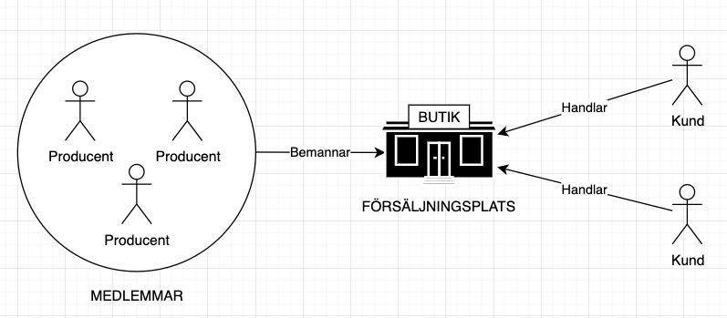
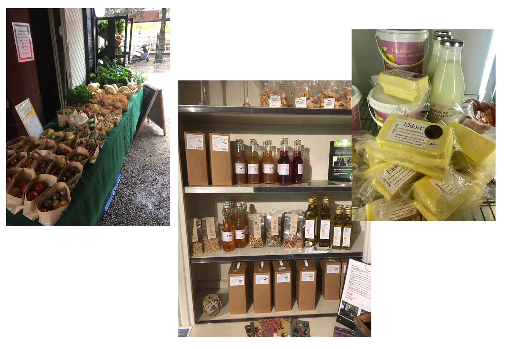

# Producentkooperativ med butik

När producenter sammansluter sig för att enklare kunna sälja tillsammans så skapar man ett producentkooperativ. Det kan handla om att ha en gemensam logistik eller andra stordriftsfördelar, gemensam marknadsföring och/eller butik.

En gemensam butik innebär större bekvämlighet för kunden och tillgång till större sortiment.

För producenternas del innebär en gemensam butik:

- Möjlighet till bättre öppettider
- Starkare varumärke / bättre dragningskraft tack vare större sortiment
- Lägre driftskostnad per producent

### Exempel

### Slättåkra Närproducerat

I Slättåkra samarbetar fyra producenter kring driften av en gemensam gårdsbutik. Det gemensamma varumärket och det ökade utbudet lockar fler kunder än om producenterna hade jobbat var och en för sig. Kooperativet sparar också tid och pengar genom att man delar på driften och turas om att bemanna butiken.

> Slättåkra Närproducerat är ett partnerskap mellan flera närliggande producenter med gemensamma värderingar - uppmuntra lokal livsmedelskonsumtion, spendera pengar på mat i lokalekonomin, skapa gemenskap i närområdet, minska koldioxidutsläppen och har en övergripande positiv miljöpåverkan. Produkter från våra medlemmar finns att köpa i vår Gårdsbutik. För restauranger och grossister kan produkter från flera lokala producenter köpas som från ett företag, levereras tillsammans och faktureras tillsammans. vi effektiviserar därmed processen för att stödja det lokala jordbruket.

Titta på webbinariet med Slättåkra Närproducerat där Molly Rygg från Lya 101 berättar mer om hur de startade och byggde upp sin verksamhet.

<iframe
  width="560"
  height="315"
  src="https://www.youtube.com/embed/OH6LLNtkdks"
  frameborder="0"
  allow="accelerometer; autoplay; clipboard-write; encrypted-media; gyroscope; picture-in-picture"
  allowfullscreen
></iframe>

### Bondens Nära i Nyköping

Bondens Nära är ett producentsamarbete för försäljning av närproducerade och småskaligt framställt/odlade produkter. Varje torsdag ställer ett antal producenter ut sina varor på Café Hellmans Bageri i Nyköping. Producenterna turas om att bemanna torsdagarna och Hellmans Bageri får draghjälp och extratillskott av kunder.

## Länkar

[Slättåkra Närproducerat](https://www.lya101.com/slttkra-kooperativ)

[Bondens Nära i Nyköping](https://www.facebook.com/bondensnara)
